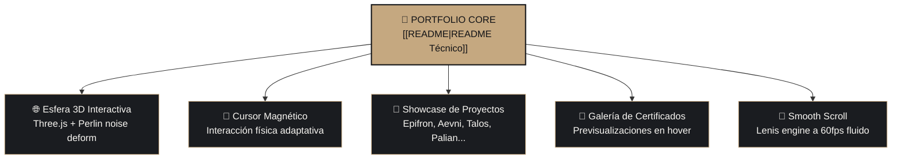

# 💼 Portfolio // Portal Maestro & Documentación

> **Portafolio profesional interactivo de Rodrigo Castillo**  
> Desarrollado con Next.js 15, Three.js, Lenis Smooth Scroll y Tailwind CSS v4. Demuestra capacidades avanzadas en frontend, agentes de IA, animación de alta fidelidad (60fps) y diseño de experiencias digitales de alto impacto.

---

## 🗺️ Mapa de Componentes del Portfolio



---

## 📚 Estructura del Código

| Sección | Descripción | Archivos Clave |
| :--- | :--- | :--- |
| **📖 [README Técnico](README.md)** | Manual de instalación, dependencias y despliegue. | `Portfolio/README.md` |
| **🎨 Escena 3D** | Renderizado WebGL de la esfera de inicio reactiva al cursor. | `src/components/3d/` |
| **🖼️ Showcase de Demos** | Componentes interactivos de demostración de software. | `src/components/demos/`, `Portfolio_demos/` |
| **📜 Certificaciones** | Catálogo visual de diplomas y cursos completados. | `Certificados/`, `src/components/certs/` |
| **📱 Rutas Dinámicas** | Páginas detalladas por cada caso de estudio (`/projects/[slug]`). | `src/app/projects/[slug]/` |

---

## ⚡ Comandos de Inicio Rápido

```bash
# Instalar dependencias
npm install

# Iniciar servidor de desarrollo en Next.js 15 (puerto 3000)
npm run dev

# Compilar para producción
npm run build
```

---

## 🗺️ Mapa de contenido

<!-- BEGIN:AUTO-INDEX -->
> [!abstract]- Índice generado — 0 portales · 3 notas
> Compilado por `Global_Skills/build-index.mjs` desde la clave `description` de cada nota.
> **No editar a mano:** se regenera. Para corregir una fila, editá el `description` de la nota.

| Nota | Qué contiene / cuándo consultarla |
| :--- | :--- |
| [[portfolio/AGENTS\|AGENTS]] | Contrato técnico del Portfolio: mapa de código crítico, Next.js 16, Three.js, puerto 3000. Leer antes de modificar portfolio/. |
| [[portfolio/Portfolio_demos/README\|README]] | Previews y demos de los proyectos mostrados en el portfolio. Las capturas salieron de las apps corriendo de verdad, no son mockups. |
| [[portfolio/README\|README]] | Portafolio profesional de Rodrigo Castillo: carta de presentación interactiva como AI Agent Engineer, con las tecnologías utilizadas. |

<!-- END:AUTO-INDEX -->
