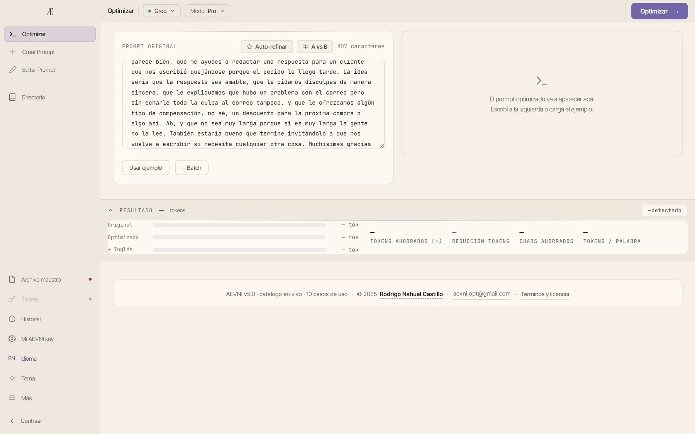

# Rodrigo Castillo - Portfolio



Bienvenido al repositorio de mi portafolio profesional interactivo. Este proyecto fue diseñado y desarrollado completamente desde cero, con el objetivo de demostrar mis capacidades en el desarrollo Frontend moderno, la construcción de experiencias de usuario (UX/UI) fluidas, y la integración de animaciones avanzadas y entornos 3D en la web.

Este portafolio sirve como mi carta de presentación, detallando mi experiencia como **AI Agent Developer Ssr** y **QA Automation Jr**, así como mis proyectos más destacados.

## Tecnologías Utilizadas

El portafolio está construido utilizando un stack moderno y escalable, priorizando el rendimiento y la estética visual:

- **Framework**: [Next.js 15](https://nextjs.org/) (App Router)
- **Lenguaje**: [TypeScript](https://www.typescriptlang.org/)
- **Estilos**: [Tailwind CSS v4](https://tailwindcss.com/)
- **Animaciones**: [Framer Motion](https://www.framer.com/motion/) para transiciones fluidas y micro-interacciones.
- **Gráficos 3D**: [Three.js](https://threejs.org/) & React Three Fiber (implementado de forma nativa para construir la esfera interactiva del inicio).
- **Scroll**: [Lenis](https://lenis.darkroom.engineering/) para una experiencia de *Smooth Scrolling* impecable.

## Características Principales

- **Diseño Ultra-Premium y Minimalista**: Inspirado en tendencias de diseño de vanguardia, con fondos oscuros orgánicos (`#141210`), tipografías enormes y contrastes limpios.
- **Esfera 3D Interactiva**: El componente principal de bienvenida renderiza una esfera construida con `IcosahedronGeometry` que "respira" mediante deformación de vértices con ruido de perlin y reacciona al movimiento del cursor del usuario.
- **Cursor Magnético Personalizado**: Reemplazo total del cursor estándar del navegador por una versión dinámica que se acopla magnéticamente a los elementos interactivos.
- **Animaciones al Hacer Scroll**: Los elementos de la interfaz aparecen gradualmente mientras se navega, gracias a interceptores de visibilidad en el viewport.
- **Previsualizaciones Dinámicas**: Un sistema complejo de *hover states* permite al usuario ver videos, capturas de pantalla de mis proyectos (Epifron, AEVNI, Career Tracker), o mis certificados obtenidos, directamente en la lista principal antes de entrar al proyecto.
- **Rutas Dinámicas de Proyectos**: Cada proyecto cuenta con una página en profundidad (`/projects/[slug]`) que detalla las características técnicas mediante galerías asíncronas.

## Despliegue Local

Si deseas correr este proyecto en tu entorno local:

1. Clona el repositorio:
   ```bash
   git clone https://github.com/Rodrigo9702/Portafolio.git
   ```
2. Instala las dependencias:
   ```bash
   npm install
   ```
3. Ejecuta el servidor de desarrollo:
   ```bash
   npm run dev
   ```
4. Abre [http://localhost:3000](http://localhost:3000) en tu navegador.

## Licencia & Contacto

Diseñado y desarrollado por **Rodrigo Castillo**.

Puedes encontrarme en [LinkedIn](https://linkedin.com/in/rodrigoncastillo) o revisar el resto de mi código aquí en [GitHub](https://github.com/Rodrigo9702). Si buscas a alguien para escalar tus proyectos o resolver problemas complejos, no dudes en contactarme.
